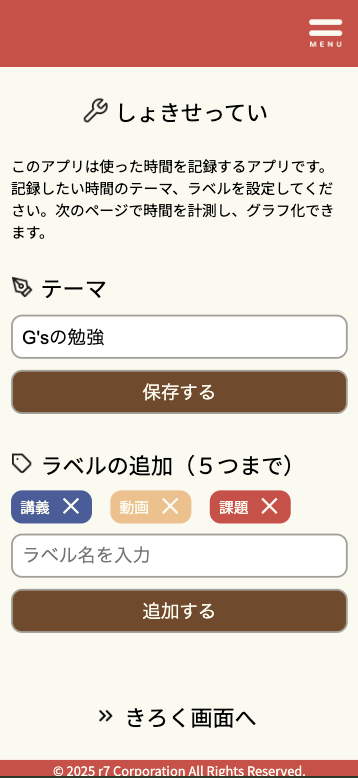
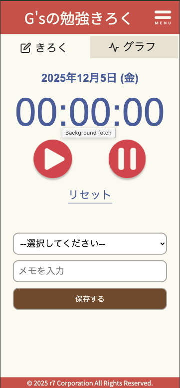
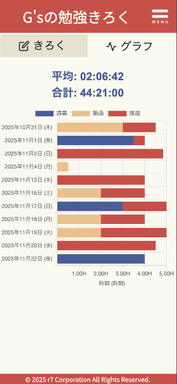
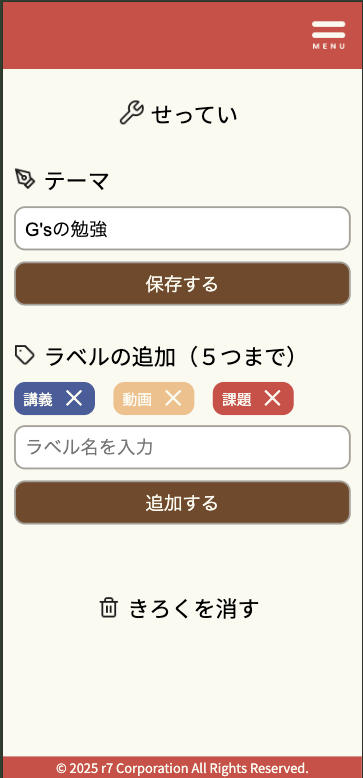

## 1.制作アプリのタイトル
- 作業記録アプリ
## 2.制作アプリの説明（40文字程度）
- G'sの勉強時間を記録して可視化するためのアプリ
## 3.工夫した点・こだわった点
- スマホサイズのUIがコレまでうまくいってなかったのでチャレンジ（どんなサイズでも表示できる）

### 初期設定画面

- ラベルを追加したり消したりした時に、LocalStrageも連動するようにした
- ハンバーガーメニューが綺麗に表示できるよう、MENU名などもできるだけまとめて統一感を出した

### きろく画面_きろくタブ

- タブ表示を実装
- 日付を取得し、計測した時間やラベル、メモとともにJSON形式で保存

### きろく画面_グラフタブ

- 積み上げ棒グラフで、自分がどこに時間を使っているのかわかるよう工夫
- グラフの調整や日付順で表示する部分は自分ではギブアップでAIにお願い
- 今後利用するために過去データを入れたかったので、自分用はサンプルデータも入れるようにした

### せってい画面

- 後からでもラベルの内容を変えたり、記録を消したりできるよう作成

## 4.次回トライしたこと（または機能）
- メモ欄のリスト表示
- 間違ったデータを消せる機能
- csvデータでのアップロード、ダウンロード
- 全体的に文字が大きくなってしまったのでUIをもっときれいにしたい

## 5.備考（感想、シェアしたいこと等なんでも）
- グラフ描画、タブなどはJqueryを活用したが、色々制限があるようで苦労した
- 今回はかなり難しく、AIに頼った部分もおおかったので、頼っても理解はできるよう取り組みたい